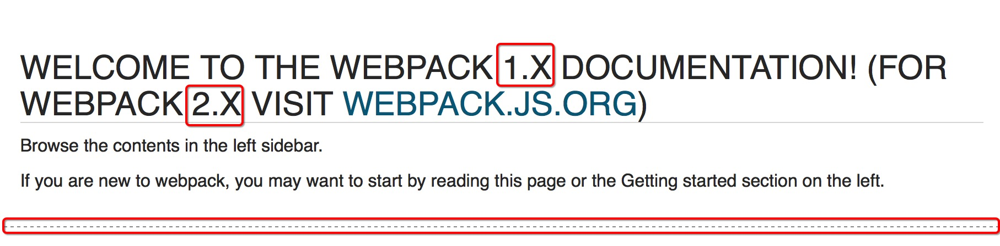
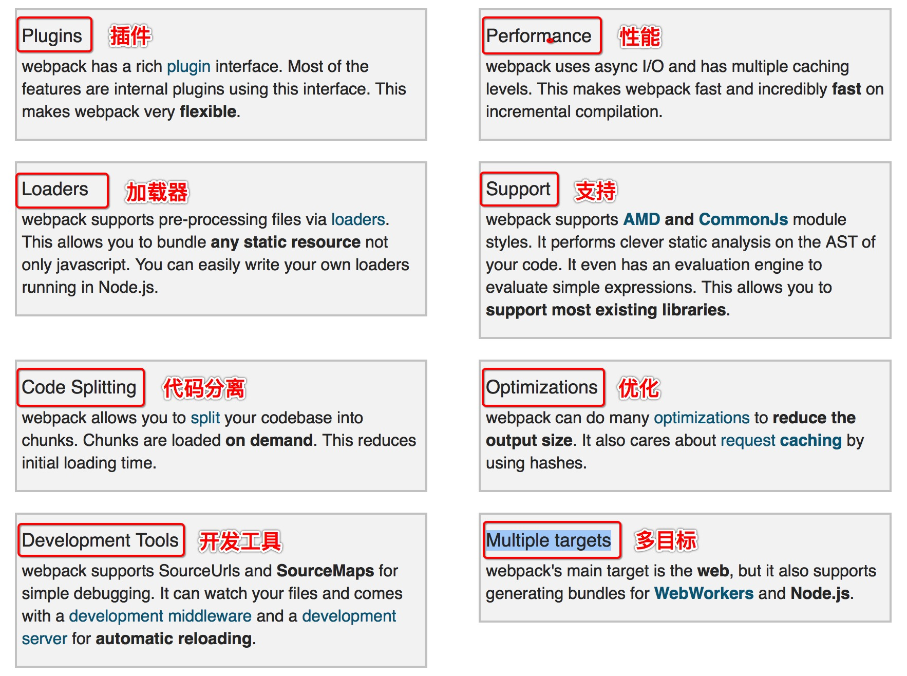

-----
title: webpack 英文文档解析

date: 2016-11-24

tags: js工具

-----

# 学习方法 

1.想要快速的了解一个概念就是不停地问: 这是什么?

**What is this?** 这是什么？this用于指代任何想了解的东西。

**Why do you use this?** 为什么用这个?也就是这个的优势是什么?既然是优势，那么一定是有对比的，不然哪里来的优势对吧。也就是说和类似的比，这个的优势在什么地方，在进一步讲就是出现它，解决了其它框架不能解决的问题?那么总结而言就是: 你用这个原因是，它解决了什么问题?

**How to do this?** 怎么做的？分析解决了什么问题以后，要知道是怎么解决的，相对于来说更深入。对于webpack解决了模块化问题，需要分析源码才能知道了。

2.在学习一个工具的开始，想要快速掌握一个工具的使用:

**可以输入什么**

**输入的是什么?**

**输出的是什么?**

# webpack

以下三个网址结合看，先后顺序。

**[webpack中文指南](http://webpackdoc.com/index.html)**

**[阮一峰的webpack demo](https://github.com/ruanyf/webpack-demos#demo01-entry-file-source)**

**[webpack英文官网](https://webpack.github.io/docs/)**

## 1.看懂导航

标题，webpack MODULE BUNDLER 简单明了地介绍了webpack是什么，(module)模块，(bundler)打包机。所以webpack是什么，webpack是模块打包机。

**HOME**  （主页）

1.头上告诉了你，webpack有1.x的还有个2.x。一条虚线，告诉你下面是webpack1.x的概括了。

2.webpack1.x或者说2.x都有如下这样的功能，介绍了webpack的骨架。

**GETTING STARTED** （开始）

1.Motivation （动机）

>介绍了开发webpack的原因和因素,看看就过了吧。

2.What is webpack?（webpack是什么?）

>介绍了webpack的打包机制，以及跟其它的打包机相比的优势。看看就过了吧。

3.Usage （使用）

>代码介绍如何安装使用，这是我们需要的。
>
>1.主要是简单的打包一个文件，然你看下webpack的打包功能。
>
>2.学会写一个简单的webpack配置文件:webpack.config.js
>
>3.使用loaders来编译ES2015,CoffeeScript,TypeScript
>记载器，说白了就是用各种语言写的代码，比如es2015,json呀这些文件，webpack不认识，然后用一个加载器把这些变成js的写法。
>
>4.使用plugins

4.Require Modules （没有文档）

5.Vendor Modules	 （没有文档）

6.Using Loaders （使用loaders，延伸Usage里面的loader,详细介绍）

**TUTORIALS AND EXAMPLES** （教程和例子）

**GUIDES** （指南）

**WEBPACK WITH** （webpack和其它的结合,如gulp...）

**LISTS** （列表，列举了大部分加载器，插件...）

**API** 	

1.Configuration （配置）*

>这里方便查找webpack.config.js里面的配置项。

**DEVELOPMENT** （发展，讲了更新的版本，开发者的变动之类的） 

 

